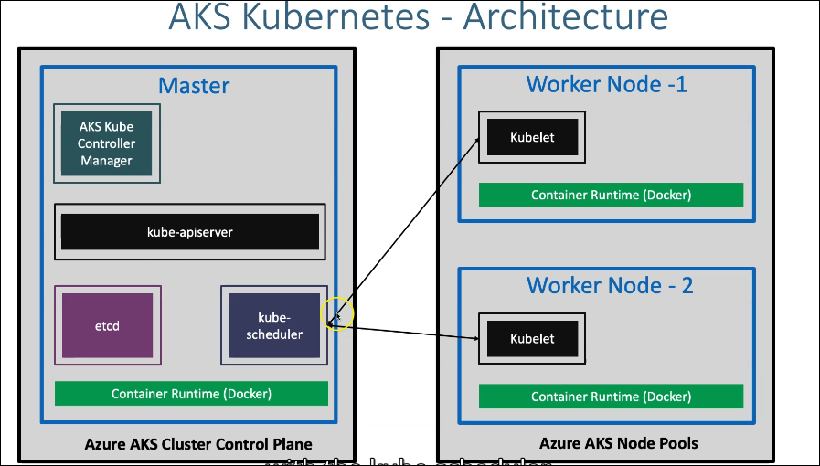

---
tags:
  - azure devops kubernetes aks cloud
date: "11-12-2024"
---

# Azure Kubernetes Service

__AKS__ - Is a Kubernetes Service that is highly available, secure and fully managed provided by Microsoft Azure.
 - Availaible in 36 regions and growing
 - Compared to other cloud providers AKS is available in the highest number of places.
 - Can run any type of workloads
  - Windows based apps Ex .NET
  - Linux supported apps Ex. Java
  - IOT device deployment and management on demand
  - Machine Learning Model training with AKS

---

## AKS Architecture

Azure AKS Cluster Control Plane & Azure AKS Node Pools

AKS Node pools are equivalent to Kubernetes worker nodes

---
AKS Cluster Control Plane is the Master component
 - Components avaialbe in the Master component
  - Container Runtime (Docker)
  - etcd stores all master and worker node information
  - kube-scheduler distributes containers across multiple nodes, also detects new parts and assigns them to nodes
  - kube-apiserver Front end for Kubernetes control plane, exposes Kubernetes api, CLI tools, kubectl, users, or master components, scheduler, controller manager, etcd, worker node components, kubelet, everything can talk tokube-apiserver to preform operations on the master
  - AKS Kube Controller Manager watches then responds when nodes, containers, or endpoints crash or go down.
    - Different controllers available
      - node controllers are for nodes
      - replication controllers maintain correct number of ports for all applications
      - endpoint controllers
      - service account
      - token controllers
---

Azure AKS Node Pools contain worker nodes
 - Worker Nodes components
  - Container Runtime (Docker) is the software where all Kubernetes components run.
  - Docker is not the only Runtime option available
   - RKTR, container D, etc. are also options
  - kubelet runs on every node in the cluster makes sure containers are running in a port on a node.  Stay in constant communication with kube-scheduler.

  - Kube-Proxy network proxy that runs on each node maintains network rules on nodes
---

### Resources

[[Create-AKS-Cluster]]
